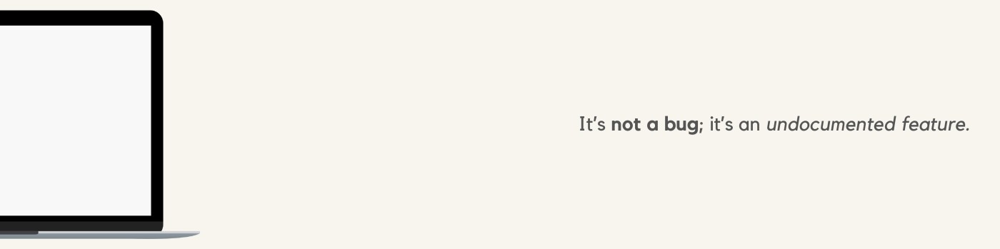

  

<h2 align="left">Hello World! I'm Shizain, a Computer Science major from India👋:</h2>

🛠️ Building a CLI text editor in Rust and developing Android apps as a hands-on learner 🎓 Fresher in Computer Science and Engineering at COER University, Roorkee 👨🏼‍💻 Leading the Competitive Coding Club, organizing events, and mentoring peers 📚 Rapidly mastering web technologies like Next.js, React, and diving into Machine Learning

<h2 align="left">💻 Tech Stack:</h2>

  
  
  
  
  
  
  
  
  
  
  
  
  
  
  
  
  
  
  
  
  
  
  
  
  
  
  
  
  
  
  
  
  
  
  
  
  
  
  

<picture>
  <source media="(prefers-color-scheme: dark)" srcset="https://raw.githubusercontent.com/tobiasmeyhoefer/tobiasmeyhoefer/output/github-snake-dark.svg" />
  <source media="(prefers-color-scheme: light)" srcset="https://raw.githubusercontent.com/tobiasmeyhoefer/tobiasmeyhoefer/output/github-snake.svg" />
  
</picture>

###
<h2 align="left">Reach Me:</h2>

  
  
  

